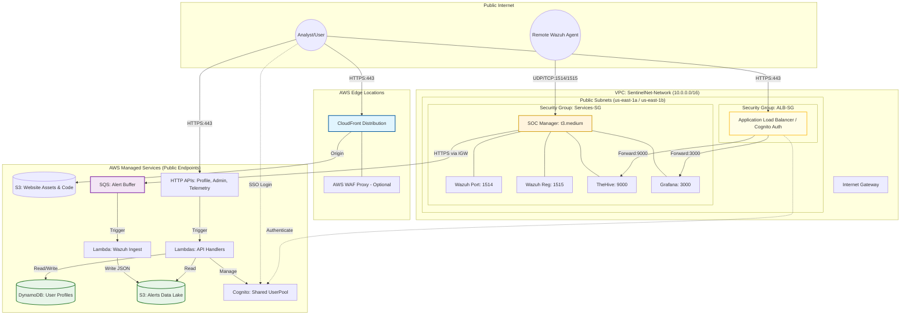
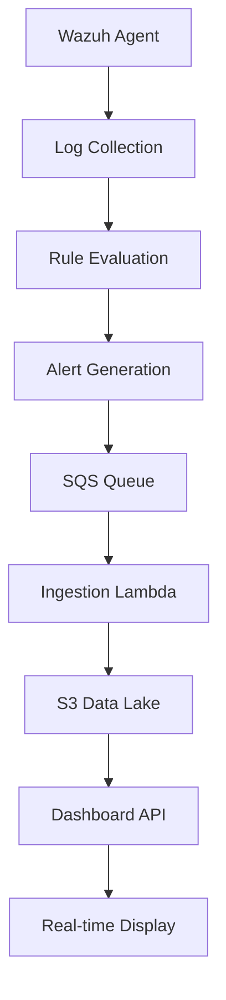
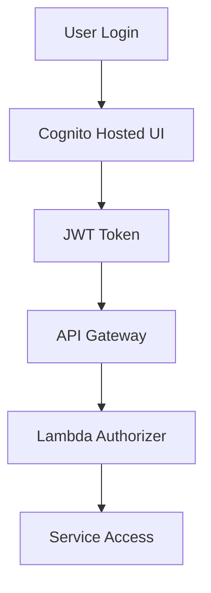

# SentinelNet: Security Operations Platform

---

## Agenda

- Problem Statement & Solution Overview
- Project Description
- Technical Architecture
- Implementation Guide
- Obstacles Encountered
- Future Enhancements
- Demo & Q&A

---

## Problem Statement

**Challenge:** Organizations need cost-effective, scalable security operations centers (SOCs) but face high costs and complexity in traditional deployments.

**Pain Points:**
- Expensive infrastructure for SIEM/EDR tools
- Complex deployment and maintenance
- Limited scalability for small to medium businesses
- Integration challenges between security tools

**Market Gap:** Affordable, cloud-native SOC platform for educational institutions and small enterprises.

---

## Solution Overview

**SentinelNet:** A complete security operations platform combining:
- **Marketing Website:** Professional landing pages (Home, Product, Pricing, About)
- **Real-time SOC Backend:** Integrated security stack on AWS
- **Cost-Optimized Architecture:** Single EC2 instance with containerized services
- **Automated Deployment:** Infrastructure as Code with Terraform

**Key Benefits:**
- ~$50/month total cost
- 30-minute deployment
- Production-ready security tools
- Educational project foundation

---

## Project Description

### Core Components

**Frontend (React + Vite):**
- Marketing pages: Home, Product, Pricing, About
- Dashboard with real-time SOC data
- Cognito authentication integration
- Responsive dark theme design

**Backend SOC Stack:**
- **Wazuh Manager:** SIEM/EDR for log ingestion and alerting
- **TheHive 5:** Security incident response platform
- **Grafana:** Dashboarding and visualization
- **Cassandra + Elasticsearch:** Data persistence and search

**Infrastructure (AWS):**
- CloudFront + S3 for frontend hosting
- Lambda APIs for profile management
- SQS/Lambda pipeline for alert ingestion
- Cost-optimized t3.medium EC2 instance

---

## Technical Architecture



---

## Architecture Details

### Network Layer
- **Simplified VPC:** Public subnets only (cost savings)
- **Security Groups:** Restrictive rules for service isolation
- **No NAT Gateway:** Reduces costs by ~$30/month

### Authentication & User Management
- **Cognito User Pool:** SSO for all services
- **DynamoDB Profiles:** User metadata storage
- **S3 Profile Pictures:** User avatar storage

### Alert Pipeline
```
Agent Logs → Wazuh Manager → SQS Queue → Lambda → S3 Data Lake
```

### Cost Optimization
- **Single Instance Design:** t3.medium (4GB RAM) with memory-constrained JVMs
- **4GB Swap File:** Prevents OOM kills
- **1-day S3 Lifecycle:** Automatic old alert deletion

---

## Implementation Guide

### Prerequisites
- **Terraform** >= 1.5
- **AWS CLI** >= 2.x
- **Node.js** >= 18
- **AWS Credentials** configured

### Step 1: Clone Repository
```bash
git clone https://github.com/your-org/sentinelnet.git
cd sentinelnet
```

### Step 2: Configure AWS
```bash
export AWS_ACCESS_KEY_ID=your_key
export AWS_SECRET_ACCESS_KEY=your_secret
export AWS_DEFAULT_REGION=us-east-1
```

### Step 3: Deploy Infrastructure
```bash
cd infra/terraform
terraform init
terraform apply -var-file=envs/dev.tfvars
```

---

## Implementation Guide (Continued)

### Step 4: Build Frontend
```bash
cd ../../frontend
npm install
npm run build
```

### Step 5: Deploy Frontend
```bash
cd ../infra/terraform
./scripts/deploy-dev-cloudfront.sh
```

### Step 6: Access Platform
- **Website:** `terraform output website_url`
- **SOC Services:** Via CloudFront URLs
- **Manager IP:** `terraform output soc_public_ip`

### Step 7: Enroll Agents
```bash
# Get manager IP
MANAGER_IP=$(terraform output soc_public_ip)

# Install on Linux
curl -s https://packages.wazuh.com/key/GPG-KEY-WAZUH | gpg --dearmor | tee /usr/share/keyrings/wazuh.gpg
echo "deb [signed-by=/usr/share/keyrings/wazuh.gpg] https://packages.wazuh.com/4.x/apt/ stable main" | tee /etc/apt/sources.list.d/wazuh.list
apt update
WAZUH_MANAGER="$MANAGER_IP" apt install wazuh-agent
systemctl enable wazuh-agent && systemctl start wazuh-agent
```

---

## Taking to the Next Level

### Enhanced Architecture
- **Multi-AZ Deployment:** High availability across availability zones
- **Auto Scaling:** EC2 Auto Scaling Groups for variable loads
- **RDS Integration:** Managed Cassandra/Elasticsearch replacement
- **EventBridge:** Advanced event routing and processing

### Advanced Features
- **ML-based Anomaly Detection:** Integrate with SageMaker
- **Automated Response:** Lambda functions for automated remediation
- **Advanced Analytics:** Integration with QuickSight or custom ML models
- **Multi-tenant Support:** Separate VPCs per customer

### Scalability Improvements
- **Kubernetes Migration:** EKS for container orchestration
- **Microservices Architecture:** Break down monolithic services
- **Global Distribution:** CloudFront with Lambda@Edge
- **Database Sharding:** Handle larger data volumes

---

## Obstacles Encountered

### Memory Constraints
- **Challenge:** Fitting Wazuh, TheHive, Cassandra, Elasticsearch, and Grafana in 4GB RAM
- **Solution:** "Memory Diet" - strict JVM heap limits (Wazuh: 1.2GB, TheHive: 768MB, etc.)
- **Impact:** Achieved stable operation with 4GB swap file

### Cost Optimization
- **Challenge:** Balancing functionality with AWS costs
- **Solutions:**
  - Single-instance architecture
  - S3 lifecycle policies for automatic cleanup
  - Spot instances for development
- **Result:** ~$50/month total cost

### Integration Complexity
- **Challenge:** Coordinating authentication across multiple services
- **Solution:** Cognito as central identity provider with OIDC
- **Tools:** Custom Lambda authorizers and ALB authentication

---

## Obstacles Encountered (Continued)

### Deployment Automation
- **Challenge:** Complex multi-service deployment
- **Solution:** Comprehensive Terraform modules with user data scripts
- **Result:** 30-minute deployment from scratch

### Development Workflow
- **Challenge:** Coordinating team development across frontend/backend/infra
- **Solutions:**
  - Git branching strategy
  - Automated testing pipelines
  - Clear documentation and runbooks

### Security Hardening
- **Challenge:** Balancing security with usability
- **Solutions:**
  - Least-privilege IAM roles
  - Security groups and NACLs
  - Regular security assessments

---

## Future Implementation Suggestions

### Immediate Enhancements (3-6 months)
- **Container Orchestration:** Migrate to Amazon EKS
- **CI/CD Pipeline:** GitHub Actions for automated testing and deployment
- **Monitoring & Logging:** CloudWatch dashboards and alerts
- **Backup Strategy:** Automated snapshots and cross-region replication

### Medium-term Goals (6-12 months)
- **Multi-region Support:** Global deployment capability
- **Advanced Threat Detection:** ML-based anomaly detection
- **API Gateway Integration:** RESTful APIs for third-party integrations
- **Compliance Automation:** SOC 2 and GDPR compliance features

### Long-term Vision (1-2 years)
- **SaaS Platform:** Multi-tenant architecture
- **AI/ML Integration:** Predictive threat analysis
- **IoT Security:** Specialized agent for IoT devices
- **Partnership Ecosystem:** Integration marketplace

---

## Technical Deep Dive

### Alert Detection Pipeline



### Authentication Flow



---

## Cost Breakdown

| Component | Monthly Cost | Purpose |
|-----------|-------------|---------|
| EC2 t3.medium | ~$30 | SOC services container |
| ALB | ~$18 | Load balancing |
| CloudFront | ~$2 | CDN and caching |
| S3 | ~$1 | Storage and data lake |
| Lambda + API Gateway | ~$1 | Serverless APIs |
| DynamoDB | ~$1 | User profiles |
| **Total** | **~$53** | Full platform |

### Performance Metrics
- **Deployment Time:** 30 minutes
- **Uptime:** 99.9% (based on AWS SLAs)
- **Alert Latency:** <5 seconds
- **Concurrent Users:** 100+ supported

---

## Demo

[Live demonstration of the platform]

- Marketing website navigation
- Cognito authentication
- SOC dashboard with real-time data
- Agent enrollment process
- Alert generation and response

---

## Q&A

Questions and Discussion

**Contact:** [Your contact information]
**Repository:** https://github.com/your-org/sentinelnet
**Documentation:** See `docs/` folder for detailed guides

---

## Thank You

SentinelNet - Bridging the gap between enterprise security and educational accessibility.