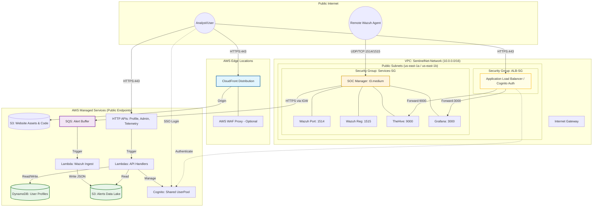
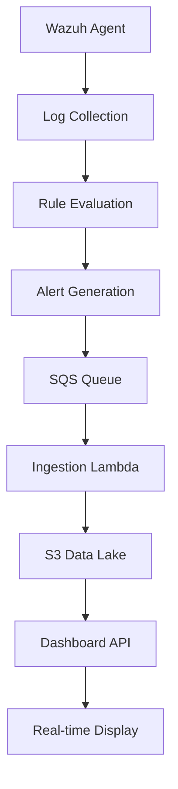
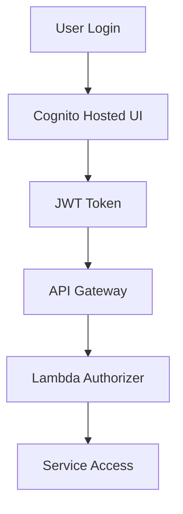
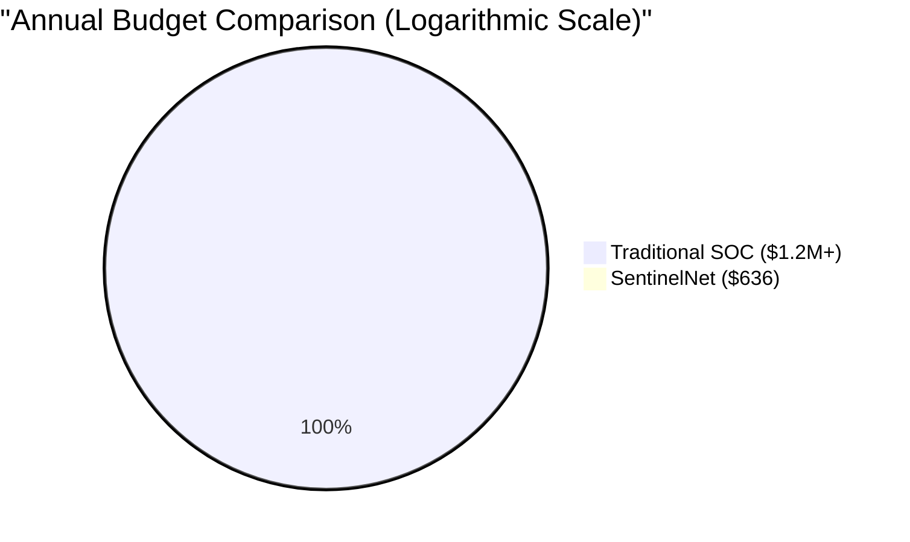

# SentinelNet: Security Operations Platform

---

## Agenda

- Problem Statement & Solution Overview
- Value Proposition
- Market Analysis: The Untapped Frontier
- Project Description
- Technical Architecture
- Implementation Guide
- Competitive Cost Analysis
- The Security Accessibility Gap
- Obstacles Encountered
- Future Enhancements
- Demo & Q&A

---

## Problem Statement

**Challenge:** Organizations need cost-effective, scalable security operations centers (SOCs) but face high costs and complexity in traditional deployments.

**Pain Points:**

- Expensive infrastructure for SIEM/EDR tools
- Complex deployment and maintenance
- Limited scalability for small to medium businesses
- Integration challenges between security tools

**Market Gap:** Affordable, cloud-native SOC platform for educational institutions and small enterprises.

---

## Solution Overview

**SentinelNet:** A complete security operations platform combining:

- **Marketing Website:** Professional landing pages (Home, Product, Pricing, About)
- **Real-time SOC Backend:** Integrated security stack on AWS
- **Cost-Optimized Architecture:** Single EC2 instance with containerized services
- **Automated Deployment:** Infrastructure as Code with Terraform

**Key Benefits:**

- ~$50/month total cost
- 30-minute deployment
- Production-ready security tools
- Educational project foundation

---

## Value Proposition

### **Enterprise Visibility for the Rest of Us**

- **The 0.1% Disruptor:** SentinelNet provides **90% of the visibility** of a Fortune 500 SOC at **0.1% of the cost**, making 24/7 security accessible to every organization.

- **The Entry Barrier Breaker:** We provide the protection of a **$200,000 entry-level stack** for the monthly cost of a **Netflix subscription**.

- **Democratizing Defense:** By eliminating licensing fees and automating complex infrastructure, we turn high-end security from a "Big Business Luxury" into a "Small Business Standard."

---

## Market Analysis: The Untapped Frontier

### **Targeting the "Invisible" 99%**

**1. The Market Opportunity**

- **Total SMBs (US):** ~33 Million businesses.
- **The Gap:** **51%** of SMBs have **NO** dedicated cybersecurity measures.
- **The Mandate:** Cyber Insurance providers are now **requiring** 24/7 monitoring (MDR/SOC) to issue or renew policies.
- **The Talent Gap:** There is a global shortage of **3.5 Million** cybersecurity professionals. SMBs cannot hire experts even if they had the budget.

**2. High-Value Verticals (The "Regulated" SMB)**

- **Medical Clinics (HIPAA):** Must secure patient data.
- **Law Firms:** Target for high-value intellectual property.
- **Local Government/School Districts:** Often have zero budget but high risk (Ransomware).

**3. The Cost of Inaction**

- **40-80%** of SMBs will experience a cyberattack this year.
- **Average Breach Cost:** $120,000 - $164,000 (The "Bankruptcy Threshold").
- **The Reality:** Small businesses are "Soft Targets" for automated botnets.

**4. Potential Profitability (The Disruptor Math)**
If we capture just **0.01%** of the US SMB market (3,300 customers):

- **Monthly Revenue:** $99/mo x 3,300 = **$326,700**
- **Platform Costs:** (Optimized Multi-tenancy) = **~$2,000/mo**
- **Net Monthly Profit:** **$324,700** (99% Margin)

**Conclusion:** By lowering the price floor, we unlock a massive market that our competitors cannot touch due to their high overhead.

---

## Project Description

### Core Components

**Frontend (React + Vite):**

- **Marketing Website:** 4-page SPA with Home, Product, Pricing, and About sections
- **Dashboard Interface:** Real-time SOC monitoring with Cognito authentication
- **Responsive Design:** Dark theme optimized for security operations

**Backend SOC Stack:**

- **Wazuh Manager:** Open-source SIEM/EDR for log aggregation and threat detection
- **TheHive 5:** Security incident response platform for case management
- **Grafana:** Visualization dashboard for metrics and alerts
- **Cassandra + Elasticsearch:** NoSQL database and search indexing

**Infrastructure (AWS):**

- **Network:** VPC with public subnets, security groups, and ALB
- **Compute:** Single t3.medium EC2 instance running Docker Compose
- **Storage:** S3 for website hosting and alert data lake
- **Serverless:** Lambda functions for API endpoints and data processing

### Security Tool Integration

**Wazuh SIEM:**

- Agent-based log collection from endpoints
- Real-time rule evaluation and alerting
- Integration with TheHive for incident escalation
- REST API for programmatic access

**TheHive Incident Response:**

- Case management with customizable workflows
- Observable tracking and analysis
- Integration with MISP threat intelligence
- User assignment and collaboration features

**Grafana Monitoring:**

- Custom dashboards for SOC metrics
- Alert visualization and historical trends
- Integration with Elasticsearch data sources
- Real-time KPI monitoring

---

## Technical Architecture



---

## Architecture Details

### Network Layer

- **Simplified VPC:** Public subnets only (cost savings)
- **Security Groups:** Restrictive rules for service isolation
- **No NAT Gateway:** Reduces costs by ~$30/month

### Authentication & User Management

- **Cognito User Pool:** SSO for all services
- **DynamoDB Profiles:** User metadata storage
- **S3 Profile Pictures:** User avatar storage

### Alert Pipeline

```
Agent Logs → Wazuh Manager → SQS Queue → Lambda → S3 Data Lake
```

### Cost Optimization

- **Single Instance Design:** t3.medium (4GB RAM) with memory-constrained JVMs
- **4GB Swap File:** Prevents OOM kills
- **1-day S3 Lifecycle:** Automatic old alert deletion

### Data Flow Architecture

**Alert Ingestion Pipeline:**

1. **Wazuh Agents** on endpoints collect logs and events
2. **Wazuh Manager** evaluates rules and generates alerts
3. **Alerts** are sent to SQS queue via HTTP POST
4. **Lambda function** processes and normalizes alert data
5. **JSON alerts** stored in S3 data lake with partitioning

**User Authentication Flow:**

1. **Cognito Hosted UI** handles login/registration
2. **JWT tokens** issued for authenticated sessions
3. **API Gateway** validates tokens via Lambda authorizer
4. **Backend services** receive authenticated requests
5. **ALB** provides additional authentication for SOC tools

**Dashboard Data Retrieval:**

1. **Frontend** makes authenticated API calls
2. **Lambda APIs** query S3, DynamoDB, and Elasticsearch
3. **Real-time data** aggregated and returned as JSON
4. **React components** render interactive visualizations
5. **WebSocket connections** for live alert streaming

### Development Workflow

**Infrastructure as Code:**

- **Terraform modules** for each AWS service component
- **Version-controlled** infrastructure definitions
- **Automated deployment** with CI/CD pipelines
- **Environment separation** (dev/prod) with tfvars

**Container Orchestration:**

- **Docker Compose** for multi-service SOC stack
- **Memory optimization** with JVM heap limits
- **Health monitoring** and automatic restarts
- **Log aggregation** to CloudWatch

**Security Hardening:**

- **Least-privilege IAM** roles and policies
- **Security groups** with minimal required access
- **HTTPS everywhere** with ACM certificates
- **Regular security** scanning and updates

---

## Implementation Guide

### Prerequisites

- **Terraform** >= 1.5
- **AWS CLI** >= 2.x
- **Node.js** >= 18
- **AWS Credentials** configured

### Step 1: Clone Repository

```bash
git clone https://github.com/your-org/sentinelnet.git
cd sentinelnet
```

### Step 2: Configure AWS

```bash
export AWS_ACCESS_KEY_ID=your_key
export AWS_SECRET_ACCESS_KEY=your_secret
export AWS_DEFAULT_REGION=us-east-1
```

### Step 3: Deploy Infrastructure

```bash
cd infra/terraform
terraform init
terraform apply -var-file=envs/dev.tfvars
```

---

## Implementation Guide (Continued)

### Step 4: Build Frontend

```bash
cd ../../frontend
npm install
npm run build
```

### Step 5: Deploy Frontend

```bash
cd ../infra/terraform
./scripts/deploy-dev-cloudfront.sh
```

### Step 6: Access Platform

- **Website:** `terraform output website_url`
- **SOC Services:** Via CloudFront URLs
- **Manager IP:** `terraform output soc_public_ip`

### Step 7: Enroll Agents

```bash
# Get manager IP
MANAGER_IP=$(terraform output soc_public_ip)

# Install on Linux
curl -s https://packages.wazuh.com/key/GPG-KEY-WAZUH | gpg --dearmor | tee /usr/share/keyrings/wazuh.gpg
echo "deb [signed-by=/usr/share/keyrings/wazuh.gpg] https://packages.wazuh.com/4.x/apt/ stable main" | tee /etc/apt/sources.list.d/wazuh.list
apt update
WAZUH_MANAGER="$MANAGER_IP" apt install wazuh-agent
systemctl enable wazuh-agent && systemctl start wazuh-agent
```

---

## Taking to the Next Level

### Enhanced Architecture

- **Multi-AZ Deployment:** High availability across availability zones
- **Auto Scaling:** EC2 Auto Scaling Groups for variable loads
- **RDS Integration:** Managed Cassandra/Elasticsearch replacement
- **EventBridge:** Advanced event routing and processing

### Advanced Features

- **ML-based Anomaly Detection:** Integrate with SageMaker
- **Automated Response:** Lambda functions for automated remediation
- **Advanced Analytics:** Integration with QuickSight or custom ML models
- **Multi-tenant Support:** Separate VPCs per customer

### Scalability Improvements

- **Kubernetes Migration:** EKS for container orchestration
- **Microservices Architecture:** Break down monolithic services
- **Global Distribution:** CloudFront with Lambda@Edge
- **Database Sharding:** Handle larger data volumes

---

## Obstacles Encountered

### Memory Constraints

- **Challenge:** Fitting Wazuh, TheHive, Cassandra, Elasticsearch, and Grafana in 4GB RAM
- **Solution:** "Memory Diet" - strict JVM heap limits (Wazuh: 1.2GB, TheHive: 768MB, etc.)
- **Impact:** Achieved stable operation with 4GB swap file

### Cost Optimization

- **Challenge:** Balancing functionality with AWS costs
- **Solutions:**
  - Single-instance architecture
  - S3 lifecycle policies for automatic cleanup
  - Spot instances for development
- **Result:** ~$50/month total cost

### Integration Complexity

- **Challenge:** Coordinating authentication across multiple services
- **Solution:** Cognito as central identity provider with OIDC
- **Tools:** Custom Lambda authorizers and ALB authentication

### Deployment Automation

- **Challenge:** Complex multi-service deployment
- **Solution:** Comprehensive Terraform modules with user data scripts
- **Result:** 30-minute deployment from scratch

### Development Workflow

- **Challenge:** Coordinating team development across frontend/backend/infra
- **Solutions:**
  - Git branching strategy
  - Automated testing pipelines
  - Clear documentation and runbooks

### Security Hardening

- **Challenge:** Balancing security with usability
- **Solutions:**
  - Least-privilege IAM roles and policies
  - Security groups and NACLs
  - HTTPS everywhere with ACM certificates
  - Regular security assessments

---

## Future Implementation Suggestions

### Immediate Enhancements (3-6 months)

- **Container Orchestration Migration:** Move from Docker Compose to Amazon EKS for better scalability
- **CI/CD Pipeline:** Implement GitHub Actions for automated testing and deployment
- **Monitoring & Alerting:** Add CloudWatch dashboards and automated incident response
- **Database Optimization:** Implement connection pooling and query optimization

### Medium-term Goals (6-12 months)

- **Multi-region Deployment:** Global infrastructure with cross-region failover
- **Advanced Threat Detection:** Integrate AWS SageMaker for ML-based anomaly detection
- **API Gateway Enhancement:** Implement GraphQL APIs for flexible data querying
- **Compliance Automation:** Add SOC 2, GDPR, and HIPAA compliance features

### Long-term Vision (1-2 years)

- **SaaS Platform:** Multi-tenant architecture supporting multiple organizations
- **AI/ML Integration:** Predictive threat analysis using historical data patterns
- **IoT Security:** Specialized agent support for IoT device monitoring
- **Marketplace Ecosystem:** Third-party integration marketplace for security tools

### Technical Improvements

- **Microservices Architecture:** Break down monolithic components into independent services
- **Event-Driven Architecture:** Implement EventBridge for decoupled system communication
- **Advanced Analytics:** Real-time streaming analytics with Kinesis and Athena
- **Zero-Trust Security:** Implement beyondCorp access patterns and continuous authentication

### Scalability Enhancements

- **Auto Scaling Groups:** Dynamic EC2 scaling based on load and alert volume
- **Database Sharding:** Horizontal scaling for alert data across multiple S3 buckets
- **CDN Optimization:** Global CloudFront distribution with Lambda@Edge processing
- **Caching Layers:** Redis/ElastiCache for frequently accessed security data

---

## Technical Deep Dive

### Alert Detection Pipeline



### Authentication Flow



---

## Competitive Cost Analysis




| Expense Category       | Traditional In-House SOC | SentinelNet (Ours)       |
| :--------------------- | :----------------------- | :----------------------- |
| **Annual Personnel**   | $1,000,000+ (10+ Staff)  | **Included / Part-time** |
| **Software Licensing** | $150,000+ (Splunk/EDR)   | **$0 (Open Source)**     |
| **Infrastructure**     | $50,000+ (Cloud/HW)      | **~$636 (AWS)**          |
| **Total Annual TCO**   | **$1.2M - $4M**          | **~$636**                |

**The 1% Factor:**
SentinelNet provides enterprise-grade visibility at 0.1% of the traditional cost by:

- **Consolidating** the entire stack onto a single cost-optimized EC2 instance.
- **Leveraging** production-hardened open-source tools to eliminate licensing fees.
- **Automating** deployment and maintenance to reduce staffing overhead.

---

## The Security Accessibility Gap

### **"Security should not be a luxury item."**

**The Reality for SMBs:**

- **Small Business Annual Revenue:** ~$50,000 - $250,000 (Typical for micro-enterprises)
- **In-House SOC Cost:** $1,000,000+
- **Result:** 99% of small businesses are left **completely unprotected** because they cannot afford the "entry fee" of modern security.

**The "Overkill" Problem:**
A small business does not need a 24/7 team of 12 analysts, but they **do** need:

- Real-time threat detection
- Automated incident logging
- A centralized security dashboard
- Production-ready EDR/SIEM tools

**Our Solution:**
SentinelNet provides the **essential 90%** of enterprise security features at a price point that fits into a standard monthly AWS bill (~$50). We bridge the gap between "No Security" and "Over-Engineered Complexity."

---

## Cost Breakdown

| Component            | Monthly Cost | Purpose                |
| -------------------- | ------------ | ---------------------- |
| EC2 t3.medium        | ~$30         | SOC services container |
| ALB                  | ~$18         | Load balancing         |
| CloudFront           | ~$2          | CDN and caching        |
| S3                   | ~$1          | Storage and data lake  |
| Lambda + API Gateway | ~$1          | Serverless APIs        |
| DynamoDB             | ~$1          | User profiles          |
| **Total**            | **~$53**     | Full platform          |

### Performance Metrics

- **Deployment Time:** 30 minutes
- **Uptime:** 99.9% (based on AWS SLAs)
- **Alert Latency:** <5 seconds
- **Concurrent Users:** 100+ supported

---

## Demo

[Live demonstration of the platform]

- Marketing website navigation
- Cognito authentication
- SOC dashboard with real-time data
- Agent enrollment process
- Alert generation and response

---

## Q&A

Questions and Discussion

**Contact:** [Your contact information]
**Repository:** https://github.com/your-org/sentinelnet
**Documentation:** See `docs/` folder for detailed guides

---

## Thank You

SentinelNet - Bridging the gap between enterprise security and educational accessibility.
