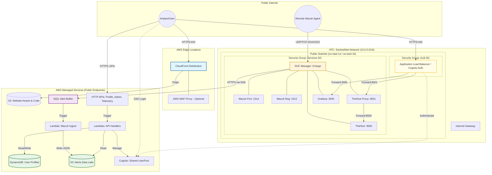

# SentinelNet — POC Foundation Architecture

This document describes the "Proof of Concept" (POC) architecture for SentinelNet. The goal of this architecture is to provide a stable, functional foundation for security services (Wazuh, TheHive, Grafana) while minimizing AWS costs (~$46/mo).

## High-Level Overview

SentinelNet consists of four main layers:
1.  **Network Layer**: A simplified VPC with public subnets only (no NAT Gateway).
2.  **User Data & Auth Layer**: Shared Cognito User Pool and DynamoDB tables for user profiles.
3.  **Frontend Layer**: A React SPA hosted on S3 and served via CloudFront.
4.  **Backend SOC Layer**: A single EC2 instance running all security services via `docker-compose`, protected by an Application Load Balancer (ALB) with Cognito authentication and a TheHive auth proxy.

---

## Architecture Diagram (Logical)

---

## Component Details

### 1. Network (SentinelNet-Network)
- **Cost Optimization**: We use `nat_gateways=0` to save ~$32/mo.
- **Subnets**: Public subnets only. All resources (EC2, ALB) are placed here.
- **Security**: Access is restricted via Security Groups. SSH is open for troubleshooting; prefer SSM for routine access.

### 2. User Data & Auth (SentinelNet-UserData)
- **Cognito**: A single User Pool shared by the Website and Backend services.
- **S3 Bucket**: Stores user profile pictures.
- **DynamoDB**: Stores user profile metadata.

### 3. Website (SentinelNet-Website)
- **Hosting**: S3 + CloudFront with an edge function for SPA routing.
- **Profile API**: A small Lambda + API Gateway (HttpApi) for the dashboard to manage user profiles.
- **Config**: Automatically generates `config.json` with the latest Telemetry and Profile API URLs.

### 4. Backend (SentinelNet-Backend)
- **Compute**: One **`t3.large`** EC2 instance (8GB RAM) with a **50GB GP3 SSD**. 
- **Memory Diet**: A **4GB Swap File** and strict JVM heap limits (512MB for Cassandra/ES, 768MB for TheHive) are applied to ensure multiple heavy services remain stable within the 4GB limits.
- **Ingestion**: A Python forwarder script monitors `alerts.json` and pushes rule hits to an SQS queue.
- **TheHive 5 Stack**: Includes **Cassandra** and **Elasticsearch** containers running in a "low-memory mode". The stack is automatically initialized during the first deployment via a bootstrap script that creates necessary proxy accounts.
- **Telemetry API**: A dedicated Lambda + HttpApi allows the dashboard to fetch the latest alerts from the **S3 Data Lake**.
- **Containerization**: Services run as Docker containers using `docker-compose`.
- **Auth**: The ALB enforces Cognito authentication. TheHive traffic is forwarded to a small auth proxy that uses credentials stored in `.thehive_proxy.env` to establish sessions.

---

## Cost Breakdown (Estimated)

| Service | Cost (Monthly) | Notes |
|---------|----------------|-------|
| **EC2 (t3.large)** | ~$60.00 | Reserved or Spot would be cheaper. |
| **ALB** | ~$16.00 | Base cost for one Load Balancer. |
| **CloudFront / S3** | < $1.00 | Free tier usually covers this. |
| **Cognito / DDB / Lambda** | ~$0.00 | Pay-per-request / Free tier. |
| **TOTAL** | **~$76.00** | vs ~$120.00 for the old setup. |

---

## Security Considerations
- **Internal Traffic**: The EC2 Security Group strictly allows traffic only from the ALB and the VPC CIDR.
- **SSM**: We use AWS Systems Manager (SSM) for instance management, eliminating the need for a Bastion host or open SSH ports.
- **Encryption**: KMS is used for SQS and DynamoDB encryption.
