# SentinelNet: Technical Project Overview

This document provides a technical breakdown of the SentinelNet architecture. It details how the infrastructure is provisioned, how the security services are configured, data flow, and how the various databases within the system operate.

## 1. Infrastructure & Provisioning 
The entire AWS infrastructure is described as Infrastructure as Code (IaC) using the **AWS Cloud Development Kit (CDK)** in Python. The deployment is broken into four distinct stacks:
- **Network Stack:** Provisions a simplified VPC with only public subnets (to save costs on NAT Gateways) and restrictive Security Groups.
- **UserData Stack:** Provisions the Cognito User Pool for authentication and DynamoDB/S3 for user profile data.
- **Website Stack:** Creates the S3 bucket and CloudFront distribution to host the React SPA. Also deploys the Profile API Gateway and Lambda.
- **Backend Stack:** Provisions the core SOC compute layer (a `t3.medium` EC2 instance), the Application Load Balancer (ALB), the SQS queues, the S3 Data Lake, and the ingestion/telemetry serverless functions.

---

## 2. Core SOC Compute (The Memory-Constrained EC2)
Unlike traditional separated designs, all primary SOC operations run on a single **t3.medium** EC2 instance (4GB RAM, 20GB GP3 SSD). 

### Containerized Environment
Services run as Docker containers orchestrated via `docker-compose.yml` (located at `/opt/sentinel/docker-compose.yml` on the instance). The components include:
- **Wazuh Manager:** Centralized log ingestion and rule evaluation.
- **TheHive 5:** Security incident response platform.
- **Cassandra & Elasticsearch:** Persistent storage and indexing layers required by TheHive.
- **Grafana:** Dashboarding platform.

### The "Memory Diet"
To fit these heavy Java-based applications into 4GB of RAM, strict JVM heap limits are instantiated at the container level:
- *Wazuh:* ~1.2 GB
- *TheHive:* 768 MB
- *Cassandra / Elasticsearch:* 512 MB each
- *Grafana:* 256 MB

A **4GB Swap File** is provisioned on the host OS via EC2 UserData to act as a buffer for memory spikes, preventing OOM kills. Instance management is handled securely via **AWS Systems Manager (SSM)**—there are no open SSH ports.

---

## 3. Databases and Storage
The application utilizes distinct databases and storage mechanisms suited to different workloads:

### A. Non-Relational (AWS fully-managed)
- **DynamoDB (Profiles API):** Used by the frontend website to store user profile metadata. Highly scalable key-value data with essentially zero operational overhead.

### B. Object Storage (AWS S3)
- **Alerts Data Lake (`AlertsDataLake` bucket):** Acts as the long-term, cheap storage for the security telemetry. Security alerts are normalized into individual JSON files. This bucket uses a **1-day lifecycle block**, automatically deleting older objects to minimize costs during this POC phase.
- **Website & Assets:** Hosts the compiled React single-page app and user profile pictures.

### C. Persistent Container Storage (Running on EC2)
- **Cassandra:** Serves as the primary database for TheHive 5. Stores state, configuration, user data, and case notes. Data is persisted to attached EC2 EBS volumes via docker bind mounts.
- **Elasticsearch:** Acts as the high-speed search index supporting TheHive. Optimized to quickly recall structured case data.

---

## 4. The Alert Data Pipeline
One of the most complex parts of the system is the pipeline that moves Wazuh alerts to the React frontend dashboard decoupled from the EC2 instance.

```mermaid
graph LR
    Agent[Wazuh Agent] --> |Port 1514| WazuhMnger[Wazuh Manager]
    WazuhMnger --> |alerts.json| FwdScript[Python Forwarder]
    FwdScript --> |Push| SQS[AWS SQS Queue]
    SQS --> |Trigger| LambdaIngest[Ingest Lambda]
    LambdaIngest --> |Write JSON| S3[S3 Data Lake]
    S3 --> |Read| TelemetryAPI[Telemetry API Lambda]
    TelemetryAPI --> |HTTP GET| Frontend[React Dashboard]
```

### 1. Ingestion
Wazuh agents (endpoints) push logs over port 1514 to the Wazuh Manager on the EC2 instance. When rules hit, Wazuh writes to a local file: `/var/ossec/logs/alerts/alerts.json`.
### 2. Forwarding (Buffering)
A custom Python daemon (`wazuh_to_sqs.py`) runs natively on the EC2 instance. Using `tail`, it monitors the `alerts.json` file. Real-time events are read and then pushed into an AWS SQS queue (`sentinel-alerts`). SQS is used to buffer bursts of alerts so backend processors aren't overwhelmed.
### 3. Serverless Processing
The SQS queue uses an event trigger attached to the `sentinel-wazuh-ingest` Lambda function. This serverless function pulls batches of messages off the queue, transforms them for consistency, and outputs them as JSON payloads into the **S3 Alert Data Lake**.
### 4. Presentation
When the analyst views the live React dashboard, the dashboard makes a request to the **Telemetry API** (API Gateway + Lambda). The Lambda function scans the S3 Data Lake, retrieves the newest 50 alert objects, and passes the parsed data securely to the frontend.

---

## 5. Security & Access Control
- **Cognito SSO:** Centralized authentication for the frontend profiles and API gateways. 
- **Application Load Balancer (ALB):** Routes administrative web traffic to the EC2 container ports. `TheHive` serves HTTP on port 80, while `Grafana` listens on 3000.
- **Security Groups:** The EC2 instance explicitly drops all ingress traffic except from the ALB, internal VPC CIDRs, and specific Wazuh agent connectivity ports.
