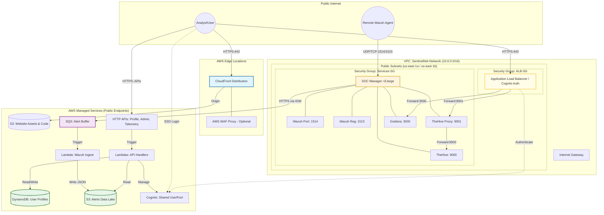

# Detection Pipeline (POC)

## Data Flow Details

### 1. Ingestion
Alerts generated by the **Wazuh Manager** are forwarded to the **SQS Buffer**. This ensures that even during high-volume events, alerts are not lost if the downstream processing is slightly delayed.

### 2. Normalization & Storage
The **Ingest Lambda** reads batches from the queue, formats them as flattened JSON objects, and saves them to the **S3 Alerts Data Lake**. It uses a **1-day lifecycle rule** to keep the POC cost-free.

### 3. Triage & Visualization
-   **TheHive**: Analysts use the Case Management system on the SOC EC2 for deep investigation and escalation.
-   **Grafana**: Executive and operational metrics are pulled from DynamoDB and Wazuh APIs for real-time visualization.

## Data Storage Strategy (POC)

SentinelNet uses a combination of S3 for SOC log history and user profile binary objects, with DynamoDB reserved for user profile metadata.

### 1. ProfilesTable
Stores SentinelNet user profile information for the analyst portal.
- **Partition Key**: `userId` (Cognito `sub`)
- **Attributes**: `displayName`, `jobFunction`, `bio`, `avatarIcon`.

## S3 Buckets

### 1. AlertsDataLake
Stores normalized security alerts as JSON files.
- **Key Structure**: `/alerts/YYYY-MM-DD/HH-MM-SS-{uuid}.json`
- **Retention**: 1-day lifecycle expiration policy.

### 2. ProfilePictures
Stores public/private profile images for analysts and clients.
- **Key Structure**: `/avatars/{userId}.jpg`
- **Security**: Block Public Access enabled; pre-signed URLs or CloudFront OAC used for access.

---

## Shared Auth (Cognito)
A single **UserPool** is used for all platform access:
- **Analyst Portal**: Hosted via CloudFront.
- **Backend Services**: Protected by the ALB OIDC authentication. TheHive traffic goes through a small auth proxy that verifies Cognito groups and creates a local TheHive session.
- **Grafana**: Executive and operational metrics are pulled from Wazuh APIs for real-time visualization.

%% =========================
%% PORTAL ACCESS (side lane)
%% =========================

subgraph ACCESS["Portal Access (side lane)"]
  USER["Analyst / Client User"] -->|"HTTPS: load UI"| CF["CloudFront"]
  CF -->|"Static site assets"| S3WEB["S3 (Portal Build)"]
  USER -->|"HTTPS: API calls"| APIREAD
end

%% =========================
%% OPS AND SECURITY (supporting)
%% =========================

subgraph SECOPS["Security + Operations (supporting)"]
  COG["Cognito (Auth + RBAC)"]
  IAM["IAM (least privilege)"]
  SM["Secrets Manager / SSM (keys + creds)"]
  CW["CloudWatch (logs + metrics + alarms)"]
end

ING -->|"JWT validation"| COG
NORM -. "Read keys/creds" .-> SM
TRI -. "Permissions scope" .-> IAM
ING -. "Logs/metrics" .-> CW
NORM -. "Logs/metrics" .-> CW
TRI -. "Logs/metrics" .-> CW
WAZ -. "Service logs" .-> CW
CORTEX -. "Service logs" .-> CW
HIVE -. "Service logs" .-> CW

%% =========================
%% Styling
%% =========================
classDef main fill:#BBDEFB,stroke:#000,color:#111;
classDef tools fill:#DCFCE7,stroke:#000,color:#111;
classDef data fill:#E9D5FF,stroke:#000,color:#111;
classDef access fill:#FFCDD2,stroke:#000,color:#111;
classDef support fill:#FFF9C4,stroke:#000,color:#111;

class START,END main;
class SRC,WAZ,ING,Q1,NORM,TRI,APIREAD,GRAF main;
class CORTEX,HIVE tools;
class EV,ARCH,S3WEB data;
class USER,CF access;
class COG,IAM,SM,CW support;